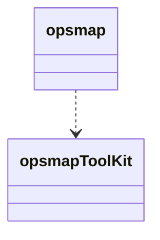

# Hello, you

This document is aimed at helping developer understand this project.

At this point, it is just a place to drop every infos relatives to the project.

This document is **NOT** a comitment to anything. It is **NOT** an official technical specifications.

Resources:

- [teamwork : task board](https://cartong.teamwork.com/#/projects/500913/tasks/board)
- [teamwork : old](https://cartong.teamwork.com/#/projects/233096/overview/summary)
- [nextcloud](https://cloud.cartong.org/s/zgsDFfpjTNHseZS)
- [gitlab](https://gitlab.cartong.org/HCR/opsmap)
- [features list](Feature-list.md) : Reference list of the features, dev oriented

People:

- Pole Manager: Sylvie de Laborderie
- PO: Maelle Aubert
- Devs: Joaquim Martin, Olivier Ribiere, Miguel Moreno, Etienne Delclaux

Tech summary:

Front only, based on [Vue.js v2](https://vuejs.org) + [Typescript](https://www.typescriptlang.org) + class-style Vue components.
The map engine is [Mapbox](https://www.mapbox.com).

## Usage

- `npm run build-lib` --> generates the lib
- `npm run build` --> generates the app (no lib)
- `npm run serve` --> generates the app (no lib) and start localhost
- `npm run doc` --> generates the doc in the docs folder

The doc is generated using TypeDoc. It doesn't seems to be ok with vuejs components. We'll see.

## Kobo Management

A kobo user for this proejct has been created. The objective is to have a readonly access to every potential opsmap related survey.

> username: cartong_reader
> passwd: @bitwarden

## Mapbox Account

A Mapbox account dedicated for Opsmaps project has been created in order to have a better monitoring of tiles consumation.

> username: opsmap.basemaps@gmail.com
> passwd: @bitwarden / Same pwd for gmail account and mapbox account

## Project architecture

For the seek of opsmap-tookit related files, variables, etc. , we will use the following prefix: TK. (ex: TKHellowWorld).

The code will be divide into libraries, packages, etc. The idea is to encapsulate stuff as musch as we can.

This code is aimed at being integrated in a two elements system:



- **opsmap**: application
- **opsmap-toolKit**: Vuejs components + javascript (pdf, csv, kobo, etc. ) package

## Current project description

This project holds two differents projects:

- a lib declaration
  The entry point is entry-point-lib.ts of the lib.

The objective is to provide multiple components and tools to a typical oppsmap, the standard opsmap.

- an app implementation
  The two entry points are entry-point-app.ts and entry-point-app.vue

The objective is to provide a way to test development inside the lib before porting them to the app. This app is for development only !

We observe the following folder structure:

```bash
src
├──components
│   ├── TKComponent1
│   │     ├── index.ts
│   │     ├── TKComponent1.vue
│   │     ├── TKComponent1Subpart1.vue
│   │     └── TKComponent1Subpart2.vue
│   └── TKComponent2.vue
├──plugins
│   └── vuetify.ts
└──domain
    └── TKdomain-related-stuff.ts

```

We observe the following behavior:

- components: the folder + file structure follows the components tree in the UI
- plugins: auto, needed by vuetify
- domain: attempt to structure. It holds the domain related competences.

This architecture needs to be reshaped. This was made a bit too on-the-fly.

## Licences

The licence of this project is specified in LICENCE.md.
The 3rd Party licences are mentionned in LICENCE-3RD-PARTY.md.

### Used in this project

- Front
  - Vue.js v2: [_MIT Licence_](https://vuejs.org)
  - Typescript: [_Apache v2.0_](https://github.com/microsoft/TypeScript/blob/master/LICENSE.txt)
  - Mapbox: Custom Licence. Free under 50k users per month. OK With this project.
  - Chart.js: [_MIT Licence_](https://www.chartjs.org/docs/latest/notes/license.html)
  - PDF.js: [_MIT Licence_](https://github.com/mozilla/pdf.js/blob/master/LICENSE)
  - html2canvas: [_MIT Licence_](https://github.com/niklasvh/html2canvas/blob/master/LICENSE)
- Tooling
  - TypeDoc: doc engine [_Apache 2.0_](https://github.com/TypeStrong/typedoc/blob/master/LICENSE)
  - Jest: [_MIT Licence_](https://pypi.org/project/sphinx-js/)
  - sinonjs: [_BSD Licence_](https://github.com/sinonjs/sinon/blob/master/LICENSE)
  - Cypress.io test runner: [_MIT Licence_](MIT licence)
    Others api used:
- [Vue.js v2](https://vuejs.org) + [Typescript](https://www.typescriptlang.org)
- [Mapbox](https://www.mapbox.com): map engine (could try OpenLayers or MapLibre)
- [Chart.js](https://www.chartjs.org)
- [PDF.js](https://mozilla.github.io/pdf.js/) + [html2canvas](https://html2canvas.hertzen.com): PDF extraction
- [TypeDoc](https://typedoc.org/): doc engine
- [Jest](https://jestjs.io): testing framework
- [sinonjs](https://sinonjs.org): improvement of Jest testing framework
- [Cypress.io](https://www.cypress.io): end to end testing

#### [MIT Licence](https://en.wikipedia.org/wiki/MIT_License)

Permissive. Do whatever you want, only if:

> The above copyright notice and this permission notice shall be included in all copies or substantial portions of the Software.

#### [Apache V2](https://www.apache.org/licenses/LICENSE-2.0)

Permissive. Do whatever you want, only if:

> You should include a copy of the Apache License, typically in a file called LICENSE, in your work, and consider also including a NOTICE file.

#### [BSD Licence](https://opensource.org/licenses/BSD-3-Clause)

Persmissive. Do whatever you want, only if:

> Redistributions of source code must retain the above copyright notice, this list of conditions and the following disclaimer.
>
> Redistributions in binary form must reproduce the above copyright notice, this list of conditions and the following disclaimer in the documentation and/or other materials provided with the distribution.
>
> Neither the name of Christian Johansen nor the names of his contributors may be used to endorse or promote products derived from this software without specific prior written permission.
